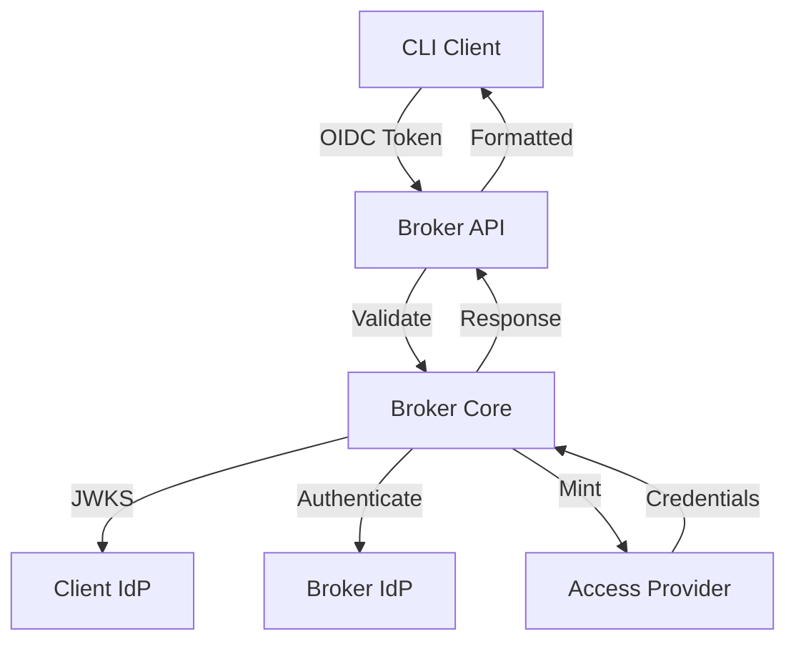

This page provides a detailed look at each component in the Voidkey system and how they interact.

## broker-core

The TypeScript core library that implements the fundamental credential brokering logic.

### Key Responsibilities

- **Token Validation**: Validates OIDC tokens against IdP JWKS endpoints
- **Provider Abstraction**: Defines interfaces for identity and access providers
- **Configuration Management**: Loads and validates configuration
- **Error Handling**: Comprehensive error types and handling

### Core Classes

#### CredentialBroker

The main orchestrator class that coordinates the credential minting workflow:

```typescript
class CredentialBroker {
  constructor(
    private config: BrokerConfig,
    private providers: {
      idp: Map<string, IdpProvider>,
      access: Map<string, AccessProvider>
    }
  ) {}

  async mintCredentials(request: MintRequest): Promise<Credentials> {
    // 1. Validate OIDC token
    // 2. Check identity configuration
    // 3. Authenticate broker with its IdP
    // 4. Call access provider to mint credentials
    // 5. Return formatted credentials
  }
}
```

#### Provider Interfaces

```typescript
interface IdpProvider {
  name: string;
  issuer: string;
  audience?: string | string[];
  
  validateToken(token: string): Promise<TokenClaims>;
  getPublicKeys(): Promise<JWKSet>;
}

interface AccessProvider {
  name: string;
  type: string;
  
  authenticate(brokerToken: string): Promise<void>;
  mintCredentials(
    config: ProviderConfig,
    subject: string
  ): Promise<RawCredentials>;
}
```

### Provider Implementations

**Identity Providers:**
- `Auth0Provider`: Auth0 OIDC integration
- `GitHubActionsProvider`: GitHub Actions OIDC tokens
- `KeycloakProvider`: Generic Keycloak/OIDC support
- `OktaProvider`: Okta identity platform

**Access Providers:**
- `AwsStsProvider`: AWS STS AssumeRoleWithWebIdentity
- `MinioProvider`: MinIO STS integration
- `GcpProvider`: Google Cloud IAM
- `AzureProvider`: Azure Active Directory

### Configuration Schema

```typescript
interface BrokerConfig {
  brokerIdp: {
    name: string;
    issuer: string;
    audience: string;
    clientId: string;
    clientSecret: string;
  };
  
  clientIdps: Array<{
    name: string;
    issuer: string;
    audience?: string | string[];
    jwksUri?: string;
  }>;
  
  accessProviders: Array<{
    name: string;
    type: string;
    endpoint?: string;
    region?: string;
    // Provider-specific config
  }>;
  
  clientIdentities: Array<{
    subject: string;
    idp: string;
    keys: Record<string, KeyConfig>;
  }>;
}
```

## broker-server

The NestJS HTTP server that exposes the broker functionality as a REST API.

### Architecture

Built on NestJS for:
- **Dependency Injection**: Clean, testable architecture
- **Middleware Pipeline**: Request validation, logging, security
- **Modular Structure**: Organized into feature modules
- **Built-in Validation**: Request/response validation

### Key Modules

#### CredentialsModule

Handles credential minting endpoints:

```typescript
@Controller('credentials')
export class CredentialsController {
  constructor(private credentialsService: CredentialsService) {}

  @Post('mint')
  async mintCredentials(@Body() request: MintRequestDto) {
    return this.credentialsService.mint(request);
  }

  @Get('keys')
  async getAvailableKeys(@Query('token') token: string) {
    return this.credentialsService.getKeysForToken(token);
  }
}
```

#### ConfigModule

Manages configuration loading and validation:

```typescript
@Module({
  providers: [
    {
      provide: CONFIG_TOKEN,
      useFactory: async () => {
        const config = await loadConfig(process.env.CONFIG_PATH);
        validateConfig(config);
        return config;
      },
    },
  ],
  exports: [CONFIG_TOKEN],
})
export class ConfigModule {}
```

#### ProvidersModule

Initializes and manages provider instances:

```typescript
@Injectable()
export class ProvidersService implements OnModuleInit {
  private idpProviders = new Map<string, IdpProvider>();
  private accessProviders = new Map<string, AccessProvider>();

  async onModuleInit() {
    await this.initializeProviders();
  }

  private async initializeProviders() {
    // Load and instantiate providers based on config
  }
}
```

### Middleware & Guards

**Security Middleware:**
- CORS configuration
- Helmet for security headers
- Rate limiting
- Request ID generation

**Validation Pipe:**
```typescript
app.useGlobalPipes(new ValidationPipe({
  whitelist: true,
  forbidNonWhitelisted: true,
  transform: true,
}));
```

### API Endpoints

#### POST /credentials/mint

Mint credentials for specified keys:

```typescript
interface MintRequest {
  oidcToken: string;
  keys: string[];
}

interface MintResponse {
  credentials: Record<string, any>;
  expiresAt: string;
}
```

#### GET /credentials/keys

List available keys for a token:

```typescript
interface KeysResponse {
  subject: string;
  keys: Array<{
    name: string;
    provider: string;
    description?: string;
  }>;
}
```

## CLI (voidkey)

The Go command-line interface for interacting with the broker.

### Architecture

Built with Cobra for:
- **Command Structure**: Clear command hierarchy
- **Flag Management**: Consistent flag handling
- **Help Generation**: Automatic help text
- **Completion**: Shell completion support

### Command Structure

```
voidkey
├── mint          # Mint credentials
│   ├── --keys    # Specific keys to mint
│   ├── --all     # Mint all available keys
│   └── --output  # Output format (env, json)
├── list-keys     # List available keys
├── version       # Show version info
└── help          # Show help
```

### Core Commands

#### mint Command

```go
func mintCmd() *cobra.Command {
  cmd := &cobra.Command{
    Use:   "mint",
    Short: "Mint temporary credentials",
    RunE: func(cmd *cobra.Command, args []string) error {
      token := getOIDCToken()
      client := newBrokerClient()
      
      response, err := client.MintCredentials(token, keys)
      if err != nil {
        return err
      }
      
      formatter := getFormatter(outputFormat)
      return formatter.Format(response)
    },
  }
  
  cmd.Flags().StringSlice("keys", nil, "Keys to mint")
  cmd.Flags().Bool("all", false, "Mint all available keys")
  cmd.Flags().String("output", "env", "Output format")
  
  return cmd
}
```

### Output Formatters

**Environment Variables:**
```bash
export AWS_ACCESS_KEY_ID="ASIATESTACCESSKEY"
export AWS_SECRET_ACCESS_KEY="testsecretkey"
export AWS_SESSION_TOKEN="testsessiontoken"
```

**JSON Format:**
```json
{
  "AWS_DEPLOYMENT": {
    "AccessKeyId": "ASIATESTACCESSKEY",
    "SecretAccessKey": "testsecretkey",
    "SessionToken": "testsessiontoken",
    "Expiration": "2024-01-15T12:00:00Z"
  }
}
```

### Configuration

The CLI can be configured via:

1. **Environment Variables:**
```bash
VOIDKEY_BROKER_URL=https://broker.example.com
VOIDKEY_OIDC_TOKEN=eyJhbGciOiJSUzI1NiIs...
VOIDKEY_OUTPUT_FORMAT=json
```

2. **Configuration File:**
```yaml
# ~/.voidkey/config.yaml
broker_url: https://broker.example.com
output_format: json
default_keys:
  - AWS_DEPLOYMENT
  - GCP_READONLY
```

3. **Command Flags:**
```bash
voidkey mint \
  --broker-url https://broker.example.com \
  --keys AWS_DEPLOYMENT \
  --output json
```

## Sandbox Environment

The Docker-based development environment for local testing.

### Services

#### Keycloak

Pre-configured identity provider with:
- **Broker Realm**: For broker authentication
- **Client Realm**: For client authentication
- **Test Users**: Pre-created test accounts
- **Service Accounts**: For broker-to-IdP auth

#### MinIO

S3-compatible storage with:
- **STS Support**: Temporary credential generation
- **Test Buckets**: Pre-created storage buckets
- **Admin Console**: Web UI for management
- **Configured Policies**: Example IAM policies

### Docker Compose Configuration

```yaml
version: '3.8'

services:
  keycloak:
    image: quay.io/keycloak/keycloak:latest
    environment:
      KEYCLOAK_ADMIN: admin
      KEYCLOAK_ADMIN_PASSWORD: admin
    ports:
      - "8080:8080"
    volumes:
      - ./realms:/opt/keycloak/data/import
    command: start-dev --import-realm

  minio:
    image: minio/minio:latest
    environment:
      MINIO_ROOT_USER: minioadmin
      MINIO_ROOT_PASSWORD: minioadmin
      MINIO_IDENTITY_OPENID_CONFIG_URL: http://keycloak:8080/realms/broker/.well-known/openid-configuration
    ports:
      - "9000:9000"
      - "9001:9001"
    command: server /data --console-address ":9001"
```

### Development Workflow

1. **Start Services:**
```bash
docker-compose up -d
```

2. **Configure Broker:**
```yaml
# Use sandbox-specific configuration
brokerIdp:
  issuer: "http://localhost:8080/realms/broker"
  clientId: "broker-service"
  clientSecret: "dev-secret"
```

3. **Run Tests:**
```bash
# Integration tests against sandbox
npm run test:integration
```

## Component Interactions

### Request Flow



### Error Handling

Each component handles errors appropriately:

1. **broker-core**: Typed errors with details
2. **broker-server**: HTTP status codes and error responses
3. **CLI**: User-friendly error messages
4. **Sandbox**: Debug-friendly logging

## Next Steps

- [Security Model](/architecture/security/) - Security architecture details
- [Configuration Guide](/configuration/guide/) - How to configure components
- [Development Setup](/development/setup/) - Set up development environment
- [API Reference](/api/rest/) - Detailed API documentation