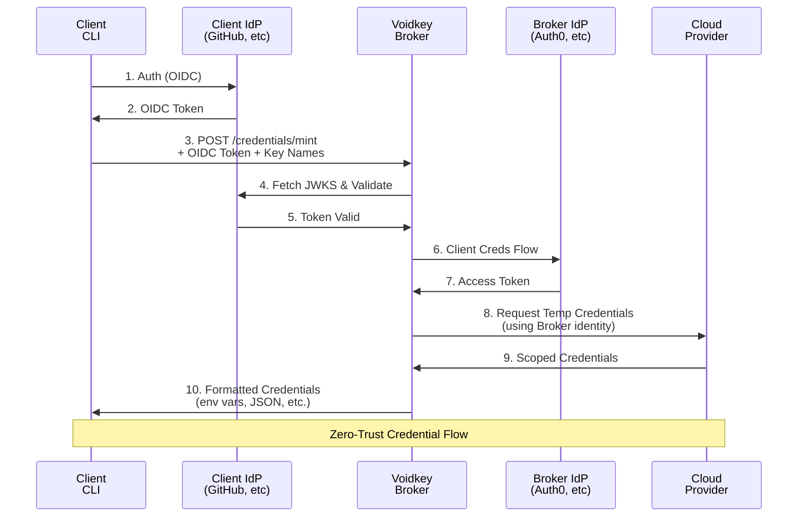
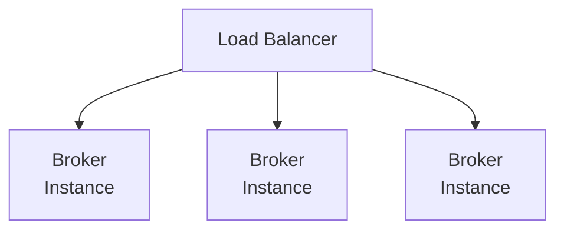

Voidkey implements a true zero-trust architecture for credential management, eliminating the need for long-lived secrets while maintaining strong security boundaries.

## Core Principles

### Zero-Trust Design

Voidkey's architecture is built on zero-trust principles:

1. **No Shared Secrets**: Clients and the broker authenticate independently with their own identity providers
2. **Verify Everything**: Every request is authenticated and authorized
3. **Least Privilege**: Credentials are scoped to minimum required permissions
4. **Time-Limited Access**: All credentials have short expiration times

## Component Architecture

### 1. Client Components

**CLI (Go)**
- Obtains OIDC tokens from client IdP
- Sends credential requests to broker
- Formats and outputs credentials

**Client Identity Providers**
- GitHub Actions OIDC
- GitLab CI OIDC
- Auth0, Okta, or any OIDC provider
- Custom IdP implementations

### 2. Broker Components

**Broker Server (NestJS)**
- Validates client OIDC tokens
- Authenticates with broker IdP
- Manages identity configurations
- Orchestrates credential minting

**Broker Core (TypeScript)**
- Token validation logic
- Provider abstractions
- Configuration management
- Error handling and logging

### 3. Cloud Providers

**Access Providers**
- AWS STS
- Google Cloud IAM
- Azure AD
- MinIO STS
- Custom provider implementations

## Data Flow

### 1. Client Authentication Flow



### 2. Token Validation

The broker validates client tokens by:
1. Fetching JWKS from the client IdP
2. Verifying token signature
3. Validating token claims (issuer, audience, expiry)
4. Checking subject against configured identities

### 3. Credential Minting

Once validated, the broker:
1. Determines allowed keys for the subject
2. Authenticates with its own IdP
3. Calls the appropriate cloud provider API
4. Returns scoped, temporary credentials

## Configuration Model

### Identity-Based Access

```yaml
clientIdentities:
  - subject: "repo:myorg/myapp:ref:refs/heads/main"
    idp: "github-actions"
    keys:
      AWS_PROD_DEPLOY:
        provider: "aws-prod"
        roleArn: "arn:aws:iam::123456789012:role/ProdDeploy"
        duration: 3600
        outputs:
          AWS_ACCESS_KEY_ID: "AccessKeyId"
          AWS_SECRET_ACCESS_KEY: "SecretAccessKey"
          AWS_SESSION_TOKEN: "SessionToken"
```

### Key-Based Permissions

Each identity can have multiple named keys:
- **Key Name**: Logical name for the credential set
- **Provider**: Which cloud provider to use
- **Configuration**: Provider-specific settings
- **Outputs**: How to map provider response to environment variables

## Security Boundaries

### 1. Network Boundaries

- **Client ↔ Broker**: HTTPS with OIDC bearer tokens
- **Broker ↔ IdPs**: HTTPS with OAuth2/OIDC
- **Broker ↔ Cloud**: HTTPS with provider-specific auth

### 2. Trust Boundaries

- **Client Trust**: Only trusts its own IdP
- **Broker Trust**: Validates client tokens but uses own identity
- **Cloud Trust**: Only trusts the broker's authenticated identity

### 3. Credential Boundaries

- **Scope**: Credentials limited to specific resources
- **Time**: Short expiration (typically 15-60 minutes)
- **Permissions**: Least privilege based on use case

## Scalability Architecture

### Stateless Design

The broker server is completely stateless:
- No session storage
- No credential caching
- Configuration loaded at startup
- Horizontal scaling ready

### High Availability

Deploy multiple broker instances behind a load balancer:



### Performance Optimization

- **JWKS Caching**: Cache IdP public keys
- **Connection Pooling**: Reuse HTTP connections
- **Async Operations**: Non-blocking I/O throughout
- **Minimal Dependencies**: Lightweight runtime

## Extensibility

### Provider Interfaces

```typescript
// Identity Provider Interface
interface IdpProvider {
  name: string;
  validateToken(token: string): Promise<TokenClaims>;
  getPublicKeys(): Promise<JWKSet>;
}

// Access Provider Interface
interface AccessProvider {
  name: string;
  type: string;
  mintCredentials(config: any): Promise<Credentials>;
}
```

### Plugin Architecture

Add new providers by implementing the interfaces:
1. Create provider implementation
2. Register with the broker
3. Configure in `config.yaml`
4. No core changes needed

## Deployment Patterns

### Container-Based

```dockerfile
FROM node:18-alpine
WORKDIR /app
COPY . .
RUN npm ci --production
EXPOSE 3000
CMD ["npm", "start"]
```

### Serverless

Deploy as serverless functions:
- AWS Lambda + API Gateway
- Google Cloud Functions
- Azure Functions
- Minimal cold start time

### Edge Deployment

Run closer to clients:
- CloudFlare Workers
- AWS Lambda@Edge
- Reduced latency
- Geographic distribution

## Monitoring & Observability

### Health Checks

```json
GET /health
{
  "status": "ok",
  "timestamp": "2024-01-15T10:30:00Z",
  "version": "0.8.0",
  "uptime": 3600
}
```

### Metrics

- Request count and latency
- Token validation success/failure
- Provider API calls
- Error rates by type

### Logging

Structured logging with:
- Request correlation IDs
- Security audit trail
- Error details
- Performance metrics

## Next Steps

- [Component Details](/architecture/components/) - Deep dive into each component
- [Security Model](/architecture/security/) - Detailed security analysis
- [Configuration Guide](/configuration/guide/) - Set up your deployment
- [API Reference](/api/rest/) - Integration details