Voidkey implements defense-in-depth security with multiple layers of protection. This document details the security model, threat analysis, and best practices.

## Security Principles

### 1. Zero Trust Architecture

**No Implicit Trust**
- Every request must be authenticated
- All tokens are validated against trusted sources
- No shared secrets between security domains

**Principle of Least Privilege**
- Credentials are scoped to minimum required permissions
- Time-limited access with short expiration
- Granular key-based access control

### 2. Defense in Depth

Multiple security layers protect against various attack vectors:

```mermaid
graph TD
    subgraph "Defense in Depth Layers"
        App["📱 Application Layer<br/>• Input validation<br/>• Rate limiting<br/>• CORS policies"]
        Auth["🔐 Authentication Layer<br/>• OIDC token validation<br/>• JWKS signature verification<br/>• Audience/issuer validation"]
        Authz["🛡️ Authorization Layer<br/>• Subject-based access control<br/>• Key-based permissions<br/>• Provider-specific policies"]
        Net["🌐 Network Layer<br/>• TLS/HTTPS only<br/>• Certificate validation<br/>• Network segmentation"]
    end
    
    App --> Auth
    Auth --> Authz
    Authz --> Net
```



## Authentication Security

### OIDC Token Validation

**Token Verification Process:**

1. **Extract Token**
   ```typescript
   const token = extractBearerToken(request.headers.authorization);
   ```

2. **Decode and Validate Structure**
   - Verify JWT structure (header.payload.signature)
   - Check required claims present
   - Validate token not expired

3. **Fetch JWKS**
   ```typescript
   const jwks = await fetchJWKS(idp.jwksUri);
   // Cache JWKS with appropriate TTL
   ```

4. **Verify Signature**
   - Match key ID (kid) from token header
   - Verify signature using public key
   - Ensure algorithm matches expected

5. **Validate Claims**
   ```typescript
   validateClaims(claims, {
     issuer: idp.issuer,
     audience: idp.audience,
     subject: identity.subject,
     expiresAt: Date.now()
   });
   ```

### Broker Authentication

The broker authenticates with its own IdP using OAuth2 client credentials:

```typescript
const brokerToken = await oauth2.clientCredentials({
  client_id: config.brokerIdp.clientId,
  client_secret: config.brokerIdp.clientSecret,
  audience: config.brokerIdp.audience
});
```

**Security Measures:**
- Client secrets stored securely (environment variables, secret managers)
- Secrets never logged or exposed
- Regular secret rotation
- Mutual TLS where supported

## Authorization Model

### Subject-Based Access Control

Access is granted based on the OIDC token subject claim:

```yaml
clientIdentities:
  - subject: "repo:myorg/myapp:ref:refs/heads/main"
    idp: "github-actions"
    keys:
      PRODUCTION_DEPLOY:
        provider: "aws-prod"
        roleArn: "arn:aws:iam::123456789012:role/ProdDeploy"
```

**Subject Patterns:**
- GitHub Actions: `repo:owner/repo:ref:refs/heads/branch`
- Service Accounts: `serviceaccount:namespace:name`
- Users: `user:email@example.com`

### Key-Based Permissions

Each subject has access to specific named keys:

```typescript
interface KeyPermission {
  name: string;           // Key identifier
  provider: string;       // Access provider to use
  config: any;           // Provider-specific configuration
  constraints?: {        // Optional constraints
    ipRanges?: string[];
    validUntil?: Date;
    maxDuration?: number;
  };
}
```

## Threat Model

### 1. Token Theft/Replay Attacks

**Threat**: Attacker steals OIDC token and attempts to reuse it

**Mitigations**:
- Short token lifetime (typically 5-15 minutes)
- Audience validation prevents cross-service usage
- Optional nonce/jti tracking for one-time use
- TLS prevents token interception

### 2. Identity Spoofing

**Threat**: Attacker attempts to impersonate legitimate identity

**Mitigations**:
- Cryptographic signature verification
- Trusted JWKS endpoints only
- Issuer validation against allowlist
- Subject claim exact matching

### 3. Privilege Escalation

**Threat**: Attacker attempts to access unauthorized resources

**Mitigations**:
- Explicit key-based permissions
- No wildcard or regex matching
- Provider-level access controls
- Audit logging of all access

### 4. Broker Compromise

**Threat**: Attacker gains access to broker service

**Mitigations**:
- Broker has no persistent access to cloud resources
- Separate authentication for each request
- Limited blast radius (only configured providers)
- Regular security updates and patching

### 5. Configuration Tampering

**Threat**: Attacker modifies configuration to grant unauthorized access

**Mitigations**:
- Configuration file access controls
- Optional configuration signing
- Audit logging of configuration changes
- Immutable deployments

## Cryptographic Security

### Supported Algorithms

**JWT Signature Algorithms:**
- RS256 (RSA SHA-256) - Recommended
- RS384 (RSA SHA-384)
- RS512 (RSA SHA-512)
- ES256 (ECDSA P-256 SHA-256)

**Not Supported (Security):**
- HS256/384/512 (Symmetric keys)
- None algorithm
- Weak RSA keys (<2048 bits)

### Key Management

**JWKS Caching:**
```typescript
const jwksCache = new LRU<string, JWKSet>({
  max: 100,
  ttl: 1000 * 60 * 60, // 1 hour
  updateAgeOnGet: false
});
```

**Key Rotation:**
- IdPs should rotate signing keys regularly
- Old keys kept for validation during transition
- Broker secrets rotated on schedule

## Network Security

### TLS/HTTPS Requirements

**All Communications Encrypted:**
- Client → Broker: HTTPS required
- Broker → IdPs: HTTPS with cert validation
- Broker → Cloud APIs: Provider-specific TLS

**TLS Configuration:**
```typescript
const httpsAgent = new https.Agent({
  minVersion: 'TLSv1.2',
  rejectUnauthorized: true,
  ca: customCABundle // if needed
});
```

### API Security Headers

```typescript
app.use(helmet({
  contentSecurityPolicy: {
    directives: {
      defaultSrc: ["'self'"],
      styleSrc: ["'self'", "'unsafe-inline'"],
    },
  },
  hsts: {
    maxAge: 31536000,
    includeSubDomains: true,
    preload: true
  }
}));
```

## Audit & Compliance

### Audit Logging

All security-relevant events are logged:

```typescript
interface AuditLog {
  timestamp: Date;
  eventType: 'AUTH_SUCCESS' | 'AUTH_FAILURE' | 'MINT_SUCCESS' | 'MINT_FAILURE';
  subject: string;
  idp: string;
  keys: string[];
  clientIp: string;
  userAgent: string;
  correlationId: string;
  error?: string;
}
```

### Compliance Controls

**SOC2 Compliance:**
- Access logs retained for 90+ days
- Encryption in transit and at rest
- Regular security assessments
- Incident response procedures

**GDPR Compliance:**
- No PII stored by broker
- Audit logs anonymizable
- Right to deletion supported
- Data minimization principle

## Security Best Practices

### Deployment Security

1. **Use Secret Management**
   ```yaml
   brokerIdp:
     clientSecret: ${BROKER_CLIENT_SECRET} # From environment
   ```

2. **Network Isolation**
   - Deploy broker in private subnet
   - Use WAF for public endpoints
   - Implement IP allowlisting where possible

3. **Regular Updates**
   ```bash
   # Automated dependency updates
   npm audit fix
   npm update
   ```

### Operational Security

1. **Monitor Security Events**
   - Failed authentication attempts
   - Unusual access patterns
   - Configuration changes
   - Error rate spikes

2. **Incident Response**
   - Revoke compromised credentials immediately
   - Rotate secrets after incidents
   - Review audit logs
   - Update security policies

3. **Access Control**
   - Limit who can modify configuration
   - Use version control for configs
   - Require PR reviews for changes
   - Automate deployment pipeline

### Development Security

1. **Secure Coding**
   ```typescript
   // Input validation
   @IsString()
   @IsNotEmpty()
   @Matches(/^[a-zA-Z0-9_-]+$/)
   keys: string[];
   ```

2. **Dependency Management**
   - Regular vulnerability scanning
   - Automated security updates
   - License compliance checks
   - Supply chain security

3. **Security Testing**
   - Unit tests for auth logic
   - Integration tests for permissions
   - Penetration testing
   - Security code reviews

## Security Checklist

Before deploying to production:

- [ ] TLS certificates configured and valid
- [ ] Secrets stored securely (not in code)
- [ ] Network security rules configured
- [ ] Audit logging enabled
- [ ] Monitoring and alerting set up
- [ ] Incident response plan documented
- [ ] Security patches up to date
- [ ] Configuration backed up
- [ ] Access controls implemented
- [ ] Security review completed

## Next Steps

- [Configuration Guide](/configuration/guide/) - Secure configuration practices
- [Deployment Guide](/deployment/production/) - Production security considerations
- [Development Guide](/development/setup/) - Secure development practices
- [API Reference](/api/authentication/) - Authentication implementation details