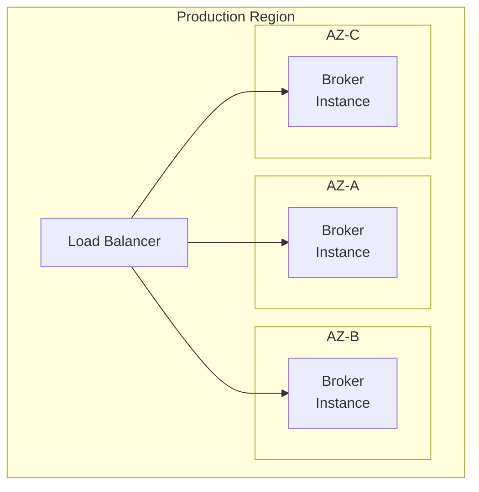
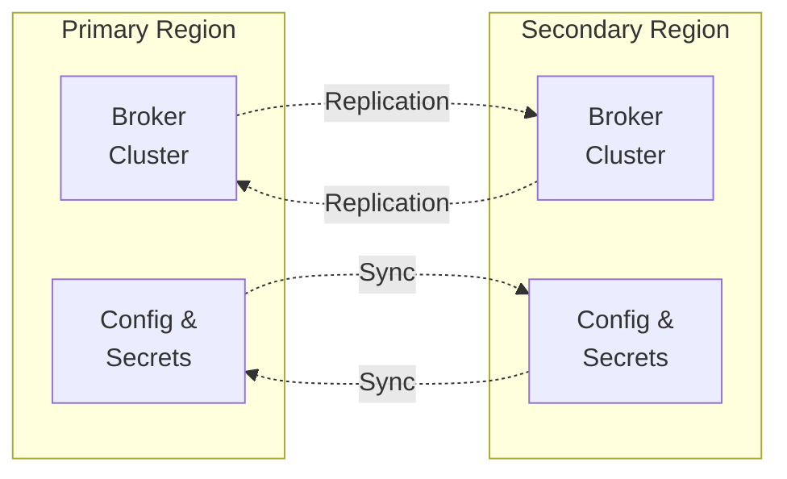

This guide covers best practices, security considerations, and operational procedures for deploying Voidkey in production environments.

## Pre-Deployment Checklist

### Infrastructure Requirements

- [ ] **Compute Resources**: Minimum 2 CPU cores, 4GB RAM per instance
- [ ] **Network**: HTTPS connectivity to IdPs and cloud providers
- [ ] **Storage**: Persistent storage for logs and configuration
- [ ] **Load Balancer**: For high availability deployments
- [ ] **Monitoring**: Metrics collection and alerting infrastructure
- [ ] **Backup**: Configuration and operational data backup strategy

### Security Requirements

- [ ] **TLS Certificates**: Valid SSL/TLS certificates for all endpoints
- [ ] **Secret Management**: Secure storage for client secrets and keys
- [ ] **Network Security**: Firewall rules and network segmentation
- [ ] **Access Control**: RBAC for administrative access
- [ ] **Audit Logging**: Comprehensive audit trail configuration
- [ ] **Vulnerability Scanning**: Regular security assessments

### Operational Requirements

- [ ] **Monitoring**: Application and infrastructure monitoring
- [ ] **Alerting**: Critical error and performance alerts
- [ ] **Logging**: Centralized log aggregation
- [ ] **Backup**: Automated backup and recovery procedures
- [ ] **Documentation**: Runbooks and operational procedures

## Architecture Patterns

### Single Region Deployment



**Benefits:**
- Lower latency within region
- Simplified operations
- Cost-effective for single-region workloads

**Considerations:**
- Single point of failure (region-wide outage)
- Limited disaster recovery options

### Multi-Region Deployment



**Benefits:**
- High availability across regions
- Disaster recovery capabilities
- Improved global performance

**Considerations:**
- Higher complexity and cost
- Configuration synchronization challenges
- Network latency between regions

## Configuration Management

### Environment-Specific Configuration

Organize configuration by environment:

```yaml
# base/config.yaml - Common configuration
brokerIdp: &brokerIdp
  name: "production-idp"
  issuer: "https://auth.company.com/realms/voidkey"
  audience: "voidkey-broker"
  clientId: "broker-service"

clientIdps: &clientIdps
  - name: "github-actions"
    issuer: "https://token.actions.githubusercontent.com"
    audience: "https://github.com/company"

# production/config.yaml - Production overrides
<<: *base
brokerIdp:
  <<: *brokerIdp
  clientSecret: "${PROD_BROKER_SECRET}"

accessProviders:
  - name: "aws-prod"
    type: "aws-sts"
    region: "us-east-1"
    externalId: "${PROD_AWS_EXTERNAL_ID}"

# staging/config.yaml - Staging overrides
<<: *base
brokerIdp:
  <<: *brokerIdp
  clientSecret: "${STAGING_BROKER_SECRET}"

accessProviders:
  - name: "aws-staging"
    type: "aws-sts"
    region: "us-west-2"
    externalId: "${STAGING_AWS_EXTERNAL_ID}"
```

### Secret Management

#### AWS Secrets Manager

```bash
# Store secrets
aws secretsmanager create-secret \
  --name "voidkey/prod/broker-secret" \
  --description "Voidkey broker client secret" \
  --secret-string "your-secret-value"

# Retrieve in application
BROKER_SECRET=$(aws secretsmanager get-secret-value \
  --secret-id "voidkey/prod/broker-secret" \
  --query SecretString --output text)
```

#### HashiCorp Vault

```bash
# Store secrets
vault kv put secret/voidkey/prod \
  broker_secret="your-secret-value" \
  aws_external_id="external-id-value"

# Retrieve in application
BROKER_SECRET=$(vault kv get -field=broker_secret secret/voidkey/prod)
```

#### Kubernetes Secrets

```yaml
apiVersion: v1
kind: Secret
metadata:
  name: voidkey-secrets
type: Opaque
data:
  broker-secret: <base64-encoded-secret>
  aws-external-id: <base64-encoded-id>
```

## Security Hardening

### Network Security

#### Firewall Rules

```bash
# Allow HTTPS traffic
iptables -A INPUT -p tcp --dport 443 -j ACCEPT

# Allow internal communication
iptables -A INPUT -s 10.0.0.0/8 -p tcp --dport 3000 -j ACCEPT

# Allow monitoring
iptables -A INPUT -s 10.0.0.0/8 -p tcp --dport 9090 -j ACCEPT

# Deny all other traffic
iptables -A INPUT -j DROP
```

#### AWS Security Groups

```terraform
resource "aws_security_group" "voidkey_broker" {
  name_prefix = "voidkey-broker-"
  
  ingress {
    from_port   = 443
    to_port     = 443
    protocol    = "tcp"
    cidr_blocks = ["0.0.0.0/0"]
  }
  
  ingress {
    from_port       = 3000
    to_port         = 3000
    protocol        = "tcp"
    security_groups = [aws_security_group.load_balancer.id]
  }
  
  egress {
    from_port   = 443
    to_port     = 443
    protocol    = "tcp"
    cidr_blocks = ["0.0.0.0/0"]  # For IdP and cloud provider access
  }
}
```

### Application Security

#### TLS Configuration

```yaml
# nginx.conf for reverse proxy
server {
    listen 443 ssl http2;
    server_name voidkey.company.com;
    
    ssl_certificate /etc/ssl/certs/voidkey.crt;
    ssl_certificate_key /etc/ssl/private/voidkey.key;
    
    ssl_protocols TLSv1.2 TLSv1.3;
    ssl_ciphers ECDHE-RSA-AES256-GCM-SHA512:DHE-RSA-AES256-GCM-SHA512:ECDHE-RSA-AES256-GCM-SHA384;
    ssl_prefer_server_ciphers off;
    
    # Security headers
    add_header Strict-Transport-Security "max-age=63072000" always;
    add_header X-Frame-Options DENY;
    add_header X-Content-Type-Options nosniff;
    add_header X-XSS-Protection "1; mode=block";
    
    location / {
        proxy_pass http://broker_backend;
        proxy_set_header Host $host;
        proxy_set_header X-Real-IP $remote_addr;
        proxy_set_header X-Forwarded-For $proxy_add_x_forwarded_for;
        proxy_set_header X-Forwarded-Proto $scheme;
    }
}
```

#### Rate Limiting

```yaml
# Application-level rate limiting
rateLimit:
  enabled: true
  windowMs: 900000  # 15 minutes
  max: 1000         # Limit each IP to 1000 requests per windowMs
  message: "Too many requests from this IP"
  standardHeaders: true
  legacyHeaders: false
```

### Access Control

#### RBAC Configuration

```yaml
# kubernetes/rbac.yaml
apiVersion: rbac.authorization.k8s.io/v1
kind: Role
metadata:
  namespace: voidkey
  name: voidkey-operator
rules:
- apiGroups: [""]
  resources: ["configmaps", "secrets"]
  verbs: ["get", "list", "watch"]
- apiGroups: ["apps"]
  resources: ["deployments"]
  verbs: ["get", "list", "watch", "update", "patch"]

---
apiVersion: rbac.authorization.k8s.io/v1
kind: RoleBinding
metadata:
  name: voidkey-operator
  namespace: voidkey
subjects:
- kind: ServiceAccount
  name: voidkey-operator
  namespace: voidkey
roleRef:
  kind: Role
  name: voidkey-operator
  apiGroup: rbac.authorization.k8s.io
```

## High Availability

### Load Balancing

#### Application Load Balancer (AWS)

```terraform
resource "aws_lb" "voidkey" {
  name               = "voidkey-broker"
  internal           = false
  load_balancer_type = "application"
  security_groups    = [aws_security_group.lb.id]
  subnets           = var.public_subnet_ids

  enable_deletion_protection = true

  tags = {
    Environment = "production"
    Application = "voidkey"
  }
}

resource "aws_lb_target_group" "voidkey" {
  name     = "voidkey-broker"
  port     = 3000
  protocol = "HTTP"
  vpc_id   = var.vpc_id

  health_check {
    enabled             = true
    healthy_threshold   = 2
    interval            = 30
    matcher             = "200"
    path                = "/health"
    port                = "traffic-port"
    protocol            = "HTTP"
    timeout             = 5
    unhealthy_threshold = 2
  }
}
```

#### Health Checks

```typescript
// Enhanced health check endpoint
@Get('/health')
async healthCheck(): Promise<HealthCheckResult> {
  const checks = await Promise.allSettled([
    this.checkBrokerIdP(),
    this.checkDatabase(),
    this.checkMemoryUsage(),
    this.checkDiskSpace()
  ]);

  const results = checks.map((check, index) => ({
    name: ['broker_idp', 'database', 'memory', 'disk'][index],
    status: check.status === 'fulfilled' ? 'healthy' : 'unhealthy',
    details: check.status === 'fulfilled' ? check.value : check.reason
  }));

  const overallStatus = results.every(r => r.status === 'healthy') 
    ? 'healthy' : 'unhealthy';

  return {
    status: overallStatus,
    timestamp: new Date().toISOString(),
    version: process.env.APP_VERSION,
    uptime: process.uptime(),
    checks: results
  };
}
```

### Auto Scaling

#### Horizontal Pod Autoscaler

```yaml
apiVersion: autoscaling/v2
kind: HorizontalPodAutoscaler
metadata:
  name: voidkey-broker
spec:
  scaleTargetRef:
    apiVersion: apps/v1
    kind: Deployment
    name: voidkey-broker
  minReplicas: 3
  maxReplicas: 20
  metrics:
  - type: Resource
    resource:
      name: cpu
      target:
        type: Utilization
        averageUtilization: 70
  - type: Resource
    resource:
      name: memory
      target:
        type: Utilization
        averageUtilization: 80
  - type: Pods
    pods:
      metric:
        name: http_requests_per_second
      target:
        type: AverageValue
        averageValue: "100"
```

## Monitoring and Observability

### Metrics Collection

#### Prometheus Configuration

```yaml
# prometheus.yml
global:
  scrape_interval: 15s

scrape_configs:
  - job_name: 'voidkey-broker'
    static_configs:
      - targets: ['voidkey-broker:3000']
    metrics_path: '/metrics'
    scrape_interval: 30s

  - job_name: 'kubernetes-pods'
    kubernetes_sd_configs:
      - role: pod
    relabel_configs:
      - source_labels: [__meta_kubernetes_pod_annotation_prometheus_io_scrape]
        action: keep
        regex: true
```

#### Custom Metrics

```typescript
// Application metrics
import { Counter, Histogram, register } from 'prom-client';

const httpRequestsTotal = new Counter({
  name: 'http_requests_total',
  help: 'Total number of HTTP requests',
  labelNames: ['method', 'route', 'status_code']
});

const httpRequestDuration = new Histogram({
  name: 'http_request_duration_seconds',
  help: 'Duration of HTTP requests in seconds',
  labelNames: ['method', 'route']
});

const credentialMintingTotal = new Counter({
  name: 'credential_minting_total',
  help: 'Total number of credential minting requests',
  labelNames: ['provider', 'subject', 'status']
});

register.registerMetric(httpRequestsTotal);
register.registerMetric(httpRequestDuration);
register.registerMetric(credentialMintingTotal);
```

### Alerting Rules

```yaml
# alerting.yml
groups:
  - name: voidkey-broker
    rules:
      - alert: VoidkeyBrokerDown
        expr: up{job="voidkey-broker"} == 0
        for: 1m
        labels:
          severity: critical
        annotations:
          summary: "Voidkey broker is down"
          description: "Voidkey broker has been down for more than 1 minute"

      - alert: VoidkeyHighErrorRate
        expr: rate(http_requests_total{job="voidkey-broker",status_code=~"5.."}[5m]) > 0.1
        for: 2m
        labels:
          severity: warning
        annotations:
          summary: "High error rate detected"
          description: "Error rate is {{ $value }} errors per second"

      - alert: VoidkeyHighLatency
        expr: histogram_quantile(0.95, rate(http_request_duration_seconds_bucket{job="voidkey-broker"}[5m])) > 1.0
        for: 5m
        labels:
          severity: warning
        annotations:
          summary: "High response latency"
          description: "95th percentile latency is {{ $value }} seconds"
```

### Logging

#### Structured Logging Configuration

```typescript
// logging.config.ts
import { WinstonModule } from 'nest-winston';
import * as winston from 'winston';

export const loggingConfig = WinstonModule.createLogger({
  transports: [
    new winston.transports.Console({
      format: winston.format.combine(
        winston.format.timestamp(),
        winston.format.errors({ stack: true }),
        winston.format.json()
      )
    }),
    new winston.transports.File({
      filename: '/var/log/voidkey/error.log',
      level: 'error',
      format: winston.format.combine(
        winston.format.timestamp(),
        winston.format.errors({ stack: true }),
        winston.format.json()
      )
    }),
    new winston.transports.File({
      filename: '/var/log/voidkey/audit.log',
      level: 'info',
      format: winston.format.combine(
        winston.format.timestamp(),
        winston.format.json()
      )
    })
  ]
});
```

#### Log Aggregation

```yaml
# fluentd-config.yaml
<source>
  @type tail
  path /var/log/voidkey/*.log
  pos_file /var/log/fluentd/voidkey.log.pos
  tag voidkey.*
  format json
</source>

<match voidkey.**>
  @type elasticsearch
  host elasticsearch.logging.svc.cluster.local
  port 9200
  index_name voidkey
  type_name _doc
</match>
```

## Disaster Recovery

### Backup Strategy

#### Configuration Backup

```bash
#!/bin/bash
# backup-config.sh

DATE=$(date +%Y%m%d_%H%M%S)
BACKUP_DIR="/backups/voidkey/$DATE"

mkdir -p "$BACKUP_DIR"

# Backup Kubernetes resources
kubectl get configmap,secret,deployment,service,ingress -n voidkey -o yaml > "$BACKUP_DIR/k8s-resources.yaml"

# Backup Helm values
helm get values voidkey -n voidkey > "$BACKUP_DIR/helm-values.yaml"

# Backup configuration files
cp -r /etc/voidkey/ "$BACKUP_DIR/config/"

# Upload to S3
aws s3 sync "$BACKUP_DIR" "s3://company-backups/voidkey/$DATE/"

echo "Backup completed: $BACKUP_DIR"
```

#### Automated Backup with CronJob

```yaml
apiVersion: batch/v1
kind: CronJob
metadata:
  name: voidkey-backup
spec:
  schedule: "0 2 * * *"  # Daily at 2 AM
  jobTemplate:
    spec:
      template:
        spec:
          containers:
          - name: backup
            image: voidkey/backup-tool:latest
            command:
            - /bin/bash
            - -c
            - |
              kubectl get configmap,secret -n voidkey -o yaml > /backup/k8s-backup.yaml
              aws s3 cp /backup/k8s-backup.yaml s3://backups/voidkey/$(date +%Y%m%d)/
          restartPolicy: OnFailure
```

### Recovery Procedures

#### Service Recovery

```bash
#!/bin/bash
# restore-service.sh

BACKUP_DATE=$1
if [ -z "$BACKUP_DATE" ]; then
  echo "Usage: $0 <backup-date>"
  exit 1
fi

echo "Restoring Voidkey from backup: $BACKUP_DATE"

# Download backup
aws s3 sync "s3://company-backups/voidkey/$BACKUP_DATE/" "/tmp/restore/"

# Restore Kubernetes resources
kubectl apply -f "/tmp/restore/k8s-resources.yaml"

# Wait for pods to be ready
kubectl wait --for=condition=ready pod -l app=voidkey-broker -n voidkey --timeout=300s

# Verify health
kubectl exec -n voidkey deployment/voidkey-broker -- curl -f http://localhost:3000/health

echo "Restore completed successfully"
```

## Performance Optimization

### Application Tuning

#### Node.js Optimization

```dockerfile
# Production Dockerfile optimizations
FROM node:18-alpine AS production

# Set Node.js production optimizations
ENV NODE_ENV=production
ENV NODE_OPTIONS="--max-old-space-size=1024 --optimize-for-size"

# Enable HTTP keep-alive
ENV HTTP_AGENT_KEEP_ALIVE=true
ENV HTTP_AGENT_MAX_SOCKETS=50

WORKDIR /app
COPY package*.json ./
RUN npm ci --only=production && npm cache clean --force

COPY dist ./dist
USER 1001
EXPOSE 3000

CMD ["node", "dist/main.js"]
```

### Database Optimization

#### Connection Pooling

```typescript
// database.config.ts
export const databaseConfig = {
  pool: {
    min: 5,
    max: 20,
    idle: 10000,
    acquire: 30000,
    evict: 1000
  },
  logging: process.env.NODE_ENV === 'development',
  dialectOptions: {
    connectTimeout: 60000,
    acquireTimeout: 60000,
    timeout: 60000
  }
};
```

### Caching Strategy

#### Redis Configuration

```yaml
apiVersion: apps/v1
kind: Deployment
metadata:
  name: redis
spec:
  replicas: 1
  selector:
    matchLabels:
      app: redis
  template:
    spec:
      containers:
      - name: redis
        image: redis:7-alpine
        args:
          - redis-server
          - --maxmemory 256mb
          - --maxmemory-policy allkeys-lru
          - --save ""
          - --appendonly no
        resources:
          requests:
            memory: "128Mi"
            cpu: "100m"
          limits:
            memory: "256Mi"
            cpu: "200m"
```

## Compliance and Auditing

### Audit Logging

```typescript
// audit.interceptor.ts
@Injectable()
export class AuditInterceptor implements NestInterceptor {
  constructor(private readonly logger: Logger) {}

  intercept(context: ExecutionContext, next: CallHandler): Observable<any> {
    const request = context.switchToHttp().getRequest();
    const startTime = Date.now();

    return next.handle().pipe(
      tap((response) => {
        const duration = Date.now() - startTime;
        
        this.logger.info('API Request', {
          method: request.method,
          url: request.url,
          ip: request.ip,
          userAgent: request.get('User-Agent'),
          subject: request.user?.sub,
          duration,
          statusCode: context.switchToHttp().getResponse().statusCode,
          requestId: request.id
        });
      }),
      catchError((error) => {
        this.logger.error('API Request Failed', {
          method: request.method,
          url: request.url,
          ip: request.ip,
          subject: request.user?.sub,
          error: error.message,
          requestId: request.id
        });
        throw error;
      })
    );
  }
}
```

### Compliance Controls

#### SOC2 Controls

```yaml
# Security controls configuration
security:
  audit:
    enabled: true
    retention: "90d"
    
  encryption:
    in_transit: true
    at_rest: true
    
  access_control:
    rbac: true
    mfa: true
    
  monitoring:
    continuous: true
    alerting: true
```

## Operational Procedures

### Deployment Process

1. **Pre-deployment Checks**
   ```bash
   # Run security scan
   docker scan voidkey/broker:latest
   
   # Run tests
   npm run test:all
   
   # Validate configuration
   voidkey config validate --config production.yaml
   ```

2. **Staged Deployment**
   ```bash
   # Deploy to staging
   helm upgrade voidkey-staging voidkey/voidkey-broker \
     --namespace voidkey-staging \
     --values staging-values.yaml
   
   # Run smoke tests
   ./scripts/smoke-tests.sh staging
   
   # Deploy to production
   helm upgrade voidkey voidkey/voidkey-broker \
     --namespace voidkey \
     --values production-values.yaml
   ```

3. **Post-deployment Verification**
   ```bash
   # Check deployment status
   kubectl rollout status deployment/voidkey-broker -n voidkey
   
   # Verify health
   curl -f https://voidkey.company.com/health
   
   # Run integration tests
   ./scripts/integration-tests.sh production
   ```

### Maintenance Procedures

#### Regular Maintenance

```bash
#!/bin/bash
# maintenance.sh

echo "Starting Voidkey maintenance..."

# Update dependencies
kubectl exec -n voidkey deployment/voidkey-broker -- npm audit fix

# Rotate logs
kubectl exec -n voidkey deployment/voidkey-broker -- logrotate /etc/logrotate.conf

# Clean up old backups
aws s3api list-objects-v2 --bucket company-backups --prefix voidkey/ --query 'Contents[?LastModified<=`2024-01-01`]' --output text | awk '{print $2}' | xargs -I {} aws s3 rm s3://company-backups/{}

# Update SSL certificates if needed
certbot renew --quiet

echo "Maintenance completed"
```

## Next Steps

- [Kubernetes Deployment](/deployment/kubernetes/) - Kubernetes-specific deployment
- [Docker Deployment](/deployment/docker/) - Docker-specific deployment
- [Monitoring Setup](/monitoring/setup/) - Detailed monitoring guide
- [Security Guide](/architecture/security/) - Security best practices