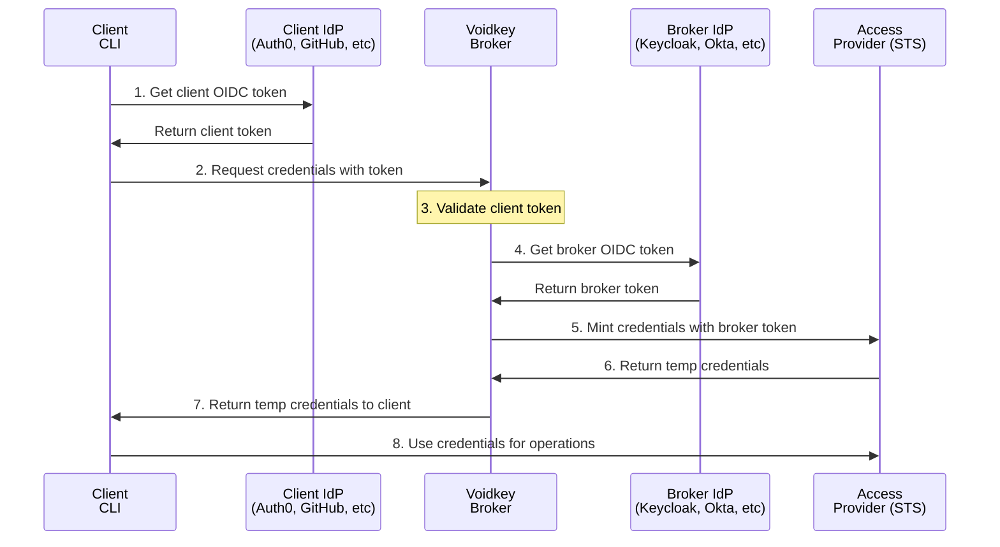

import { Card, CardGrid } from '@astrojs/starlight/components';

## What is Voidkey?

Voidkey is a **zero-trust credential broker** that eliminates the need for long-lived secrets in modern workflows. It dynamically mints short-lived, scoped credentials using OIDC-based authentication, creating a secure bridge between identity providers and cloud resources.

<CardGrid stagger>
	<Card title="Zero Trust Architecture" icon="shield">
		No shared secrets between clients and cloud providers. Each component authenticates independently.
	</Card>
	<Card title="Dynamic Credentials" icon="refresh">
		Generate temporary credentials on-demand with configurable expiration times.
	</Card>
	<Card title="OIDC Integration" icon="key">
		Native support for GitHub Actions, Auth0, Okta, Keycloak, and more identity providers.
	</Card>
	<Card title="Multi-Cloud Support" icon="cloud">
		Works with AWS and MinIO, with Azure and GCP support coming soon.
	</Card>
</CardGrid>

## Key Features

- **🔐 True Zero-Trust**: Separate authentication for clients and broker with no shared secrets
- **🔑 Key-Based Access**: Fine-grained permission control with named credential keys
- **🚀 Production Ready**: Enterprise-grade NestJS server with comprehensive security features
- **🛠️ Developer Friendly**: Easy-to-use CLI and well-documented REST API
- **📦 Extensible**: Plugin architecture for custom identity and cloud providers
- **🧪 Well Tested**: Comprehensive test suite with full coverage

## Use Cases

### CI/CD Pipelines
Eliminate hardcoded secrets in your CI/CD pipelines. Voidkey integrates natively with GitHub Actions, GitLab CI, and other platforms to provide secure, temporary credentials for deployments.

### Development Workflows
Provide developers with time-limited access to cloud resources without distributing long-lived credentials. Perfect for local development and testing scenarios.

### Microservices Authentication
Enable secure service-to-service communication with dynamic credential generation based on service identity.

### Compliance & Auditing
Meet security compliance requirements with comprehensive audit logging and credential lifecycle tracking.

## Quick Example

```bash
# Request temporary AWS credentials
voidkey mint --keys AWS_DEPLOYMENT

# Use in your workflow
export $(voidkey mint --keys AWS_DEPLOYMENT --output env)
aws s3 cp build/ s3://my-bucket/ --recursive
```

## Architecture Overview



1. **Client gets OIDC token** from their identity provider (GitHub Actions, Auth0, etc.)
2. **Client requests credentials** from Voidkey broker with OIDC token and key names
3. **Broker validates client token** against the client's identity provider JWKS
4. **Broker gets its own token** from the broker's identity provider for authentication
5. **Broker mints credentials** using its token to authenticate with cloud provider STS
6. **Cloud provider returns** temporary, scoped credentials to the broker
7. **Broker returns credentials** to the client with expiration information
8. **Client uses credentials** for authorized operations against cloud resources

## Next Steps

<CardGrid>
	<Card title="Quick Start" icon="rocket">
		Get up and running with Voidkey in minutes using our Docker sandbox environment.
		[Start Here →](/getting-started/quickstart/)
	</Card>
	<Card title="Architecture" icon="puzzle">
		Understand the components and security model behind Voidkey.
		[Learn More →](/architecture/overview/)
	</Card>
	<Card title="Configuration" icon="setting">
		Configure identity providers, access providers, and permissions.
		[Configure →](/configuration/guide/)
	</Card>
	<Card title="API Reference" icon="document">
		Explore the REST API endpoints and integration options.
		[View API →](/api/rest/)
	</Card>
</CardGrid>